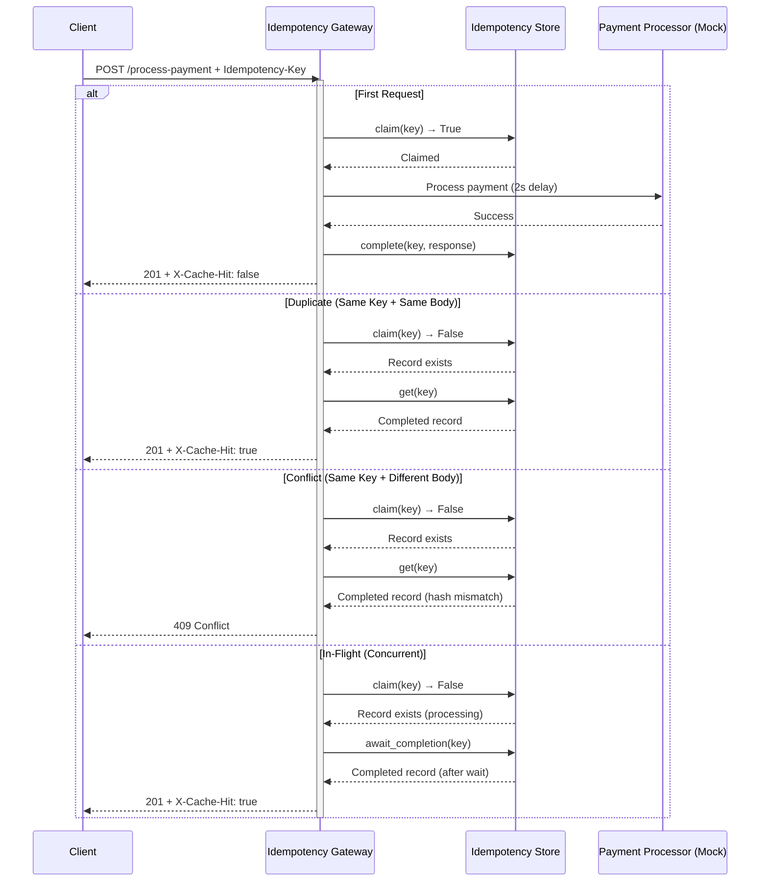
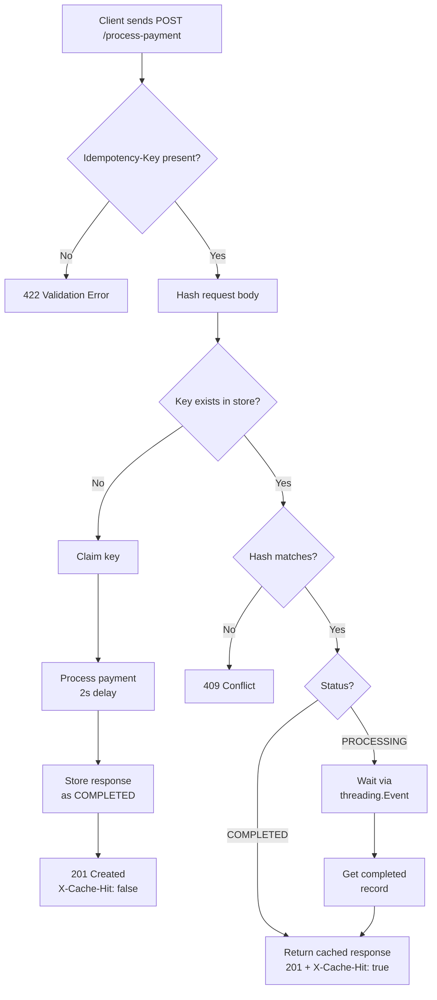

# Idempotency Gateway

A payment processing API that guarantees exactly-once execution using idempotency keys. Built for FinSafe Transactions Ltd.

[](https://python.org)
[](https://fastapi.tiangolo.com)

## Table of Contents

- [Overview](#overview)
- [Architecture](#architecture)
- [Features](#features)
- [Tech Stack](#tech-stack)
- [Setup Instructions](#setup-instructions)
- [API Documentation](#api-documentation)
- [Example Requests](#example-requests-by-user-story)
- [Design Decisions](#design-decisions)
- [Developer's Choice: Rate Limiting](#developers-choice-rate-limiting)
- [Testing Strategy](#testing-strategy)
- [Project Structure](#project-structure)

---

## Overview

FinSafe Transactions faced a critical problem: customers being double-charged when e-commerce clients retried requests after network timeouts. This service implements an idempotency layer that ensures every payment is processed **exactly once**, regardless of how many times the same request is sent.

---
## Architecture

<!-- <div align="center">
<table width="100%">
<tr>
<td width="50%" valign="top"> -->

### Sequence Diagram


<!-- </td>
<td width="50%" valign="top"> -->

### Flowchart


<!-- </td>
</tr>
</table>
</div> -->

---

## Features

- **Exactly-Once Processing**: Same key + same body = cached response, no double charge
- **Conflict Detection**: Same key + different body = 409 error, protecting data integrity
- **Race Condition Handling**: Concurrent requests with the same key are safely coordinated
- **Rate Limiting**: 5 requests per minute per IP (sliding window)
- **TTL Expiration**: Keys automatically expire after 24 hours
- **CORS Enabled**: Ready for browser-based clients

---

## Tech Stack

- **Framework**: [FastAPI](https://fastapi.tiangolo.com/)
- **Language**: Python 3.12
- **Storage**: In-memory dictionary with threading locks
- **Concurrency**: `threading.Lock` + `threading.Event` for in-flight coordination
- **Configuration**: `pydantic-settings` with `.env` support
- **Testing**: `pytest` with 20 integration tests
- **Documentation**: Automatic OpenAPI (Swagger / ReDoc)

---

## Project Structure

```

./Idempotency-Gateway/*
        ├─ app/*
        |       ├─ config.py
        |       ├─ hashing.py
        |       ├─ main.py
        |       ├─ models.py
        |       ├─ rate_limiting.py
        |       ├─ services.py
        |       ├─ storage.py
        |       └─ __init__.py
        ├─ tests/*
        |       ├─ conftest.py
        |       ├─ test_api.py
        |       ├─ test_cors.py
        |       └─ test_rate_limit.py
        ├─ .env
        ├─ .env.example
        ├─ .gitignore
        ├─ LICENSE
        ├─ main.py
        ├─ README.md
        └─ requirements.txt
```

---

## Setup Instructions

### Prerequisites

- Python 3.12+
- Git

### Installation

```bash
# Clone your fork
git clone https://github.com/Programming-Sai/Idempotency-Gateway.git
cd Idempotency-Gateway

# Create virtual environment
python -m venv venv
source venv/bin/activate  # On Windows: venv\Scripts\activate

# Install dependencies
pip install -r requirements.txt

# Copy environment variables
cp .env.example .env
# Edit .env if needed (defaults work out of the box)

# Run the server
python main.py
```

Server starts at `http://localhost:8000`

### Configuration

| Variable                    | Default   | Description                     |
| --------------------------- | --------- | ------------------------------- |
| `RATE_LIMIT_MAX_REQUESTS`   | 5         | Max requests per IP per window  |
| `RATE_LIMIT_WINDOW_SECONDS` | 60        | Time window in seconds          |
| `IDEMPOTENCY_TTL_SECONDS`   | 86400     | Key expiration time (24h)       |
| `PAYMENT_PROCESSING_DELAY`  | 2.0       | Simulated processing delay      |
| `AWAIT_COMPLETION_TIMEOUT`  | 30.0      | Max wait for in-flight requests |
| `CORS_ORIGINS`              | `["*"]`   | Allowed origins (JSON array)    |
| `PORT`                      | 8000      | Server port                     |
| `HOST`                      | 127.0.0.1 | Bind address                    |

---

## API Documentation

Interactive docs available at:

- Swagger UI: `http://localhost:8000/docs`
- ReDoc: `http://localhost:8000/redoc`

### `POST /process-payment`

Processes a payment exactly once using an idempotency key.

**Headers**

| Header            | Required | Description                                |
| ----------------- | -------- | ------------------------------------------ |
| `Idempotency-Key` | Yes      | Unique identifier for this payment attempt |
| `Content-Type`    | Yes      | `application/json`                         |

**Request Body**

```json
{
  "amount": 100,
  "currency": "GHS"
}
```

| Field      | Type    | Description                            |
| ---------- | ------- | -------------------------------------- |
| `amount`   | integer | Payment amount, must be greater than 0 |
| `currency` | string  | 3-letter ISO currency code             |

**Responses**

#### ✅ 201 Created — First Request

```json
{
  "message": "Charged 100 GHS",
  "status": "success"
}
```

Headers: `X-Cache-Hit: false`

#### ✅ 201 Created — Duplicate Request

Same body as first request.  
Headers: `X-Cache-Hit: true`

#### ❌ 409 Conflict — Key Reused with Different Body

```json
{
  "detail": "Idempotency key already used for a different request body."
}
```

#### ❌ 422 Unprocessable Entity — Validation Error

```json
{
  "detail": [
    {
      "loc": ["body", "amount"],
      "msg": "Input should be greater than 0",
      "type": "greater_than"
    }
  ]
}
```

#### ❌ 429 Too Many Requests — Rate Limit Exceeded

```json
{
  "detail": "Rate limit exceeded. Try again later."
}
```

Headers: `Retry-After`, `X-RateLimit-*`

---

## Example Requests

### User Story 1: First Transaction (Happy Path)

```bash
curl -X POST http://localhost:8000/process-payment \
  -H "Idempotency-Key: unique-payment-123" \
  -H "Content-Type: application/json" \
  -d '{"amount": 100, "currency": "GHS"}'
```

**Response:** 201 Created, ~2 second delay, `X-Cache-Hit: false`.

---

### User Story 2: Duplicate Attempt (Idempotency)

```bash
# First request (processed normally)
curl -X POST http://localhost:8000/process-payment \
  -H "Idempotency-Key: duplicate-test-456" \
  -H "Content-Type: application/json" \
  -d '{"amount": 100, "currency": "GHS"}'

# Duplicate (same key, same body)
curl -X POST http://localhost:8000/process-payment \
  -H "Idempotency-Key: duplicate-test-456" \
  -H "Content-Type: application/json" \
  -d '{"amount": 100, "currency": "GHS"}'
```

**Response:** 201 Created, instant, `X-Cache-Hit: true`.

---

### User Story 3: Different Request, Same Key (Fraud / Error Check)

```bash
# First request
curl -X POST http://localhost:8000/process-payment \
  -H "Idempotency-Key: conflict-test-789" \
  -H "Content-Type: application/json" \
  -d '{"amount": 100, "currency": "GHS"}'

# Different body, same key
curl -X POST http://localhost:8000/process-payment \
  -H "Idempotency-Key: conflict-test-789" \
  -H "Content-Type: application/json" \
  -d '{"amount": 500, "currency": "GHS"}'
```

**Response:** 409 Conflict.

---

### Bonus: In-Flight Race Condition

```bash
# Run simultaneously in two terminals

# Terminal 1
curl -X POST http://localhost:8000/process-payment \
  -H "Idempotency-Key: race-test-000" \
  -H "Content-Type: application/json" \
  -d '{"amount": 100, "currency": "GHS"}'

# Terminal 2 (immediately after)
curl -X POST http://localhost:8000/process-payment \
  -H "Idempotency-Key: race-test-000" \
  -H "Content-Type: application/json" \
  -d '{"amount": 100, "currency": "GHS"}'
```

**Result:** Both return 201. Terminal 1 takes ~2s. Terminal 2 waits, then returns instantly with `X-Cache-Hit: true`. Only one payment processed.

---

## Design Decisions

### 1. In-Memory Store with Threading Primitives

The idempotency store is a plain Python dictionary protected by a `threading.Lock`. Writes (claiming a key, marking completion) are atomic. For in-flight coordination, each in-progress key holds a `threading.Event` — waiting requests call `event.wait()` with zero CPU usage, and the first request signals completion via `event.set()`. The lock is held only for microseconds during reads and writes, never during the 2-second payment delay, so no key blocks another.

### 2. Request Fingerprinting with SHA-256

```python
hash = hashlib.sha256(json.dumps(body, sort_keys=True).encode()).hexdigest()
```

`sort_keys=True` ensures the same hash regardless of field ordering in the JSON payload. SHA-256 provides collision resistance strong enough for financial use without any external dependency.

### 3. TTL Expiration

Keys expire after 24 hours (configurable). Expiration is checked lazily on access — no background cleanup thread. This keeps the implementation simple while preventing unbounded memory growth over time.

### 4. Why Threading Over Asyncio

The service was initially prototyped with asyncio. However, pytest-asyncio introduced brittleness in concurrent test scenarios, making it hard to reliably verify the in-flight behaviour. Threading primitives (`Lock`, `Event`) provide the same correctness guarantees with simpler, deterministic test execution.

---

## Developer's Choice: Rate Limiting

Idempotency protects honest clients from accidental double charges. Duplicate requests with known keys are cheap — they hit the cache and return instantly. But a request with a **unique key** is a full resource claim: it acquires a lock, runs the 2-second processing delay, and writes to the store.

This means the attack surface isn't duplicate keys — it's **unique keys at volume**. A buggy client in a retry loop generating fresh keys on each attempt, or a malicious actor deliberately flooding the endpoint, bypasses idempotency entirely. Every request looks legitimate to the store.

Rate limiting is the layer that addresses this. Idempotency guarantees correctness for honest clients. Rate limiting is what makes the system safe against dishonest or broken ones. A fintech API without both is only half-protected.

**Implementation:**

- Sliding window algorithm (5 requests per minute per IP by default)
- Uses `X-Forwarded-For` with fallback to `request.client.host` for IP resolution
- Returns standard `X-RateLimit-Limit`, `X-RateLimit-Remaining`, `X-RateLimit-Reset`, and `Retry-After` headers

---

## Testing Strategy

| Test File            | Tests | What It Verifies                              |
| -------------------- | ----- | --------------------------------------------- |
| `test_api.py`        | 10    | Core idempotency, race conditions, TTL expiry |
| `test_cors.py`       | 5     | CORS headers, preflight requests              |
| `test_rate_limit.py` | 5     | Rate limiting, window reset, IP isolation     |

**Key scenarios covered:**

- First request processes with ~2s delay, returns `X-Cache-Hit: false`
- Duplicate request returns instantly with `X-Cache-Hit: true`
- Conflicting body on same key returns 409
- 5 concurrent requests with same key: 1 processed, 4 serve cached result
- 5 different keys processed in parallel complete in ~2s total, not 10s
- Key treated as new after TTL expiry
- 6th request from same IP within window returns 429

All 20 tests pass in approximately 86 seconds, reflecting realistic 2-second processing delays.

---
